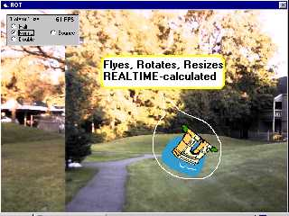



## Another VB Speed Proof \- Realtime Picture Rotate\+Resize\+  Trasparency

### Description

Ok, guys, this time no Assembler tricks, just pure VB code. Well, a little tricky DIB-processing, but still pure VB. Making pretty impressive results: 60+ FPS (PII-400/TNT2, on included bitmaps - btw, try to replace them by yours), proving that VB is fast enough. It's all about truecolor image processing.

I commented the code as best as I can and hope to hear some feedbacks from you. Again, let me know what FPS do you have. And, please, don't try to measure it in 256 colors mode.
 
### More Info
 

             |
---                |---
**Submitted On**   |2000-10-08 16:37:00
**By**             |[Dmitry Apukhtin](https://github.com/Planet-Source-Code/PSCIndex/blob/master/ByAuthor/dmitry-apukhtin.md)
**Level**          |Advanced
**User Rating**    |4.7 (90 globes from 19 users)
**Compatibility**  |VB 5\.0, VB 6\.0
**Category**       |[Graphics](https://github.com/Planet-Source-Code/PSCIndex/blob/master/ByCategory/graphics__1-46.md)
**World**          |[Visual Basic](https://github.com/Planet-Source-Code/PSCIndex/blob/master/ByWorld/visual-basic.md)
**Archive File**   |[CODE\_UPLOAD105151082000\.zip](https://github.com/Planet-Source-Code/dmitry-apukhtin-another-vb-speed-proof-realtime-picture-rotate-resize-trasparency__1-11939/archive/master.zip)

### API Declarations

some DIBs stuff

